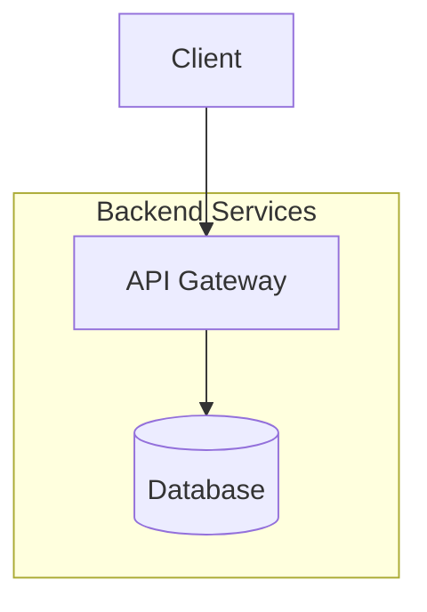
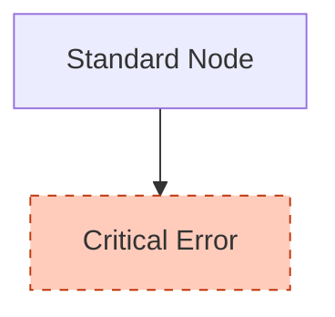
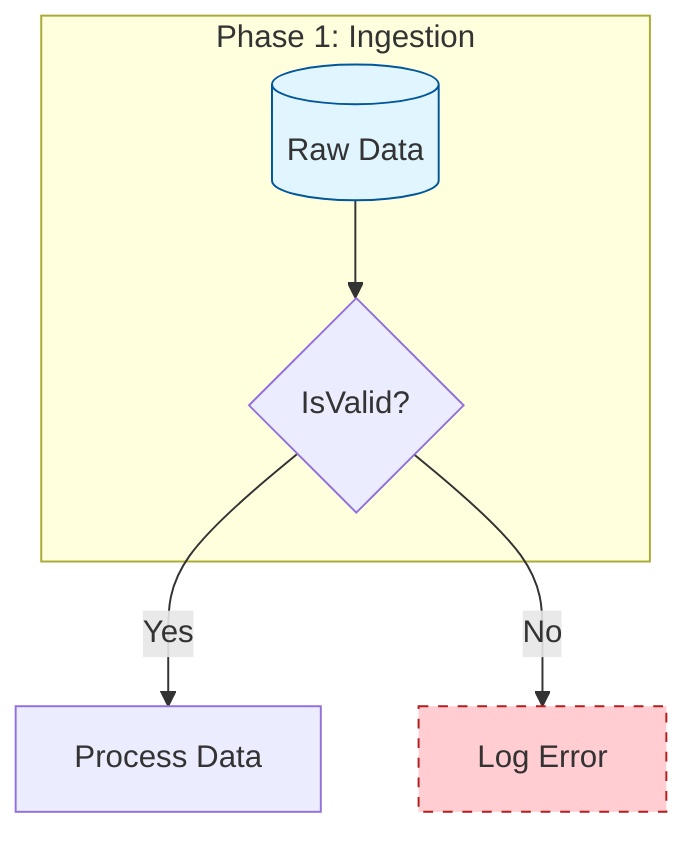

# User Manual & Best Practices

To get the best results when converting Mermaid diagrams to Visio, follow these guidelines. The converter is designed to interpret specific Mermaid syntax and map it to rich Visio features.

## 1. Containers (Subgraphs)

Mermaid `subgraph` elements are mapped to Visio **Containers**. This allows you to group related nodes physically. In Visio, moving the container will move all nodes inside it.

**Syntax:**


## 2. Smart Routing

The converter defaults to Right-Angle (Orthogonal) routing for connectors. This keeps diagrams clean and professional.
- **Tip:** Stick to standard top-down (`TD`) or left-right (`LR`) directions in your graph definition.

## 3. Styling & Colors

You can control the visual appearance of your Visio shapes using standard Mermaid styling. The converter maps these to Visio cell properties.

### Supported Styles
- **Fill Color:** `fill:#hexcode`
- **Stroke Color:** `stroke:#hexcode`
- **Stroke Width:** `stroke-width:2px`
- **Dashed Lines:** `stroke-dasharray: 5 5`
- **Text Alignment:** `text-align:left|right|center` (Maps to Visio paragraph alignment)
- **Font Styles:** `font-weight:bold`, `font-style:italic`

**Example:**


## 4. Interactivity (Hyperlinks)

Links in your diagram can be clickable in Visio. Use the `click` directive.

**Syntax:**
```mermaid
click NodeID "https://example.com" "Tooltip Text"
```

## 5. Shape Fidelity

The tool attempts to map specific Mermaid shapes to their closest Visio equivalents.

| Mermaid Shape | Syntax | Visio Mapping |
| :--- | :--- | :--- |
| **Cylinder** | `[(Name)]` | Database |
| **Rhombus** | `{Name}` | Decision |
| **Stadium** | `([Name])` | Start/End |
| **Subroutine** | `[[Name]]` | Process (Double-edged) |
| **Rectangle** | `[Name]` | Process / Rectangle |
| **Circle** | `((Name))` | Circle |

## 6. Full Example

Here is a complex example that utilizes all features:


